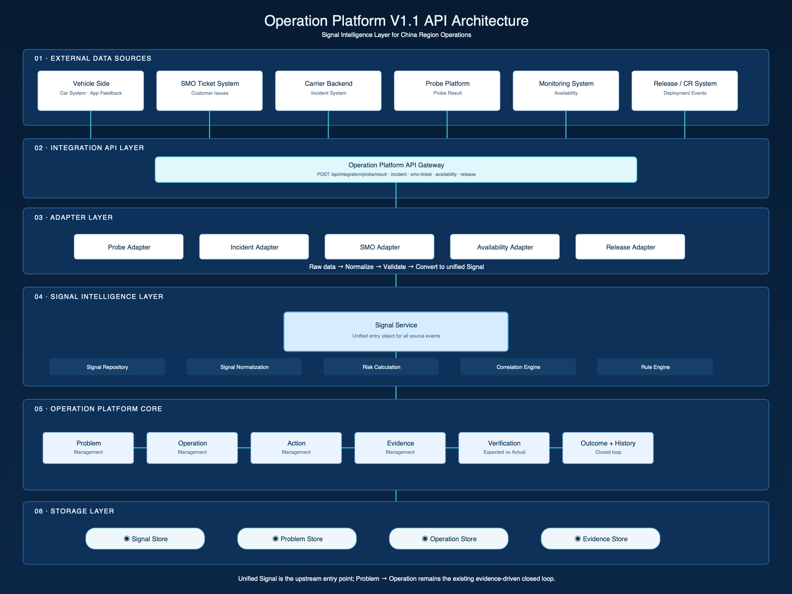
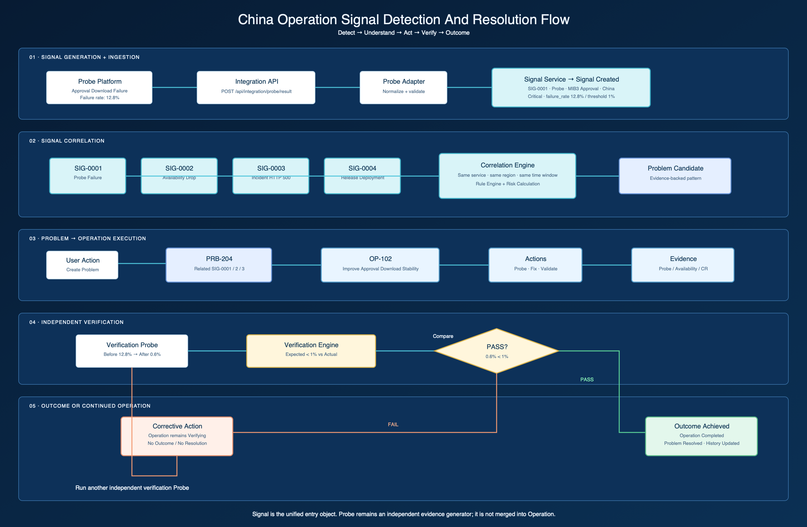
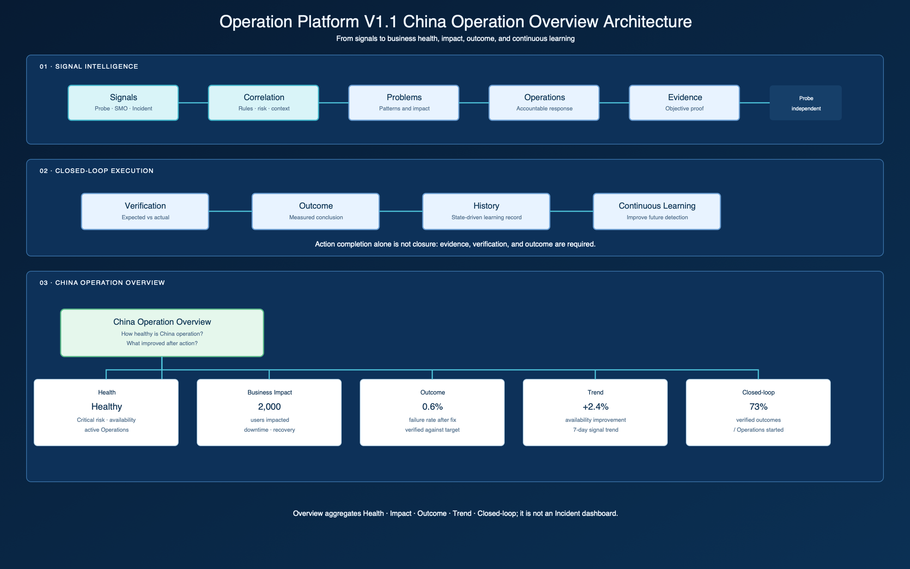

# Operation Platform V1.1 Architecture

## Scope

V1.1 introduces a **Signal Intelligence Layer** upstream of the existing evidence-driven Operation Platform closed loop. It uses prototype state and mock integration events only. It does not replace the Problem, Operation, Action, Evidence, Verification, Outcome, or History model.

## API Architecture



External China-region sources submit source-specific events through the API Gateway:

```text
POST /api/integration/probe/result
POST /api/integration/incident
POST /api/integration/smo-ticket
POST /api/integration/availability
POST /api/integration/release
```

Each adapter normalizes and validates raw input before it becomes a shared `Signal`. Signal Service, Risk Calculation, Correlation Engine, and Rule Engine then determine whether related signals form a Problem Candidate. From that point, the existing closed loop takes over:

```text
Problem → Operation → Action → Evidence → Verification → Outcome → History
```

## Signal Lifecycle

`Signal` is the unified entry object, not a synonym for Incident. A Signal may be created from Probe, Availability, Incident, SMO Ticket, or Release data. It includes source, type, service, region, environment, severity, status, metric, impact, timestamp, and related object references.

Correlation uses service, region, and time window to form an evidence-backed Problem Candidate. A Problem may therefore exist even when no Backend Incident has been reported.

## Data Flow



The reference flow begins with `SIG-0001`: a Probe reports a 12.8% Approval Download failure in China against a 1% threshold. It is correlated with Availability, Incident, and Release signals; the user can create `PRB-204`, then `OP-102`, and attach actions and evidence.

Verification compares expected and actual evidence. A pass completes the Operation, resolves the Problem, and records Outcome and History. A failure keeps the Operation in `Verifying`, requires a corrective action, and starts another independent verification cycle.

## China Operation Overview



The Overview is the business-facing aggregation layer. It answers how healthy China operation is, what users and services are impacted, what Operations completed, and whether Outcomes were verified. Its KPI links route to filtered Problems, Operations, Signals, or History views. It is intentionally separate from Command Center: Overview explains performance; Command Center prioritizes attention.

## Integration Boundaries

- Probe remains an independent product and produces Probe Results that Operation consumes as Evidence.
- Integration adapters own source-specific contracts; Signal Service owns the normalized Signal contract.
- V1.1 does not introduce real external APIs, email ingestion, AI correlation, or changes to `server.js`.

## Assets

- [API Architecture SVG](./Operation_Platform_V1.1_API_Architecture.svg)
- [Signal Data Flow SVG](./Operation_Platform_V1.1_Data_Flow.svg)
- [API Architecture PNG](./Operation_Platform_V1.1_API_Architecture.png)
- [Signal Data Flow PNG](./Operation_Platform_V1.1_Data_Flow.png)
- [China Operation Overview SVG](./Operation_Platform_V1.1_Overview_Architecture.svg)
- [China Operation Overview PNG](./Operation_Platform_V1.1_Overview_Architecture.png)
